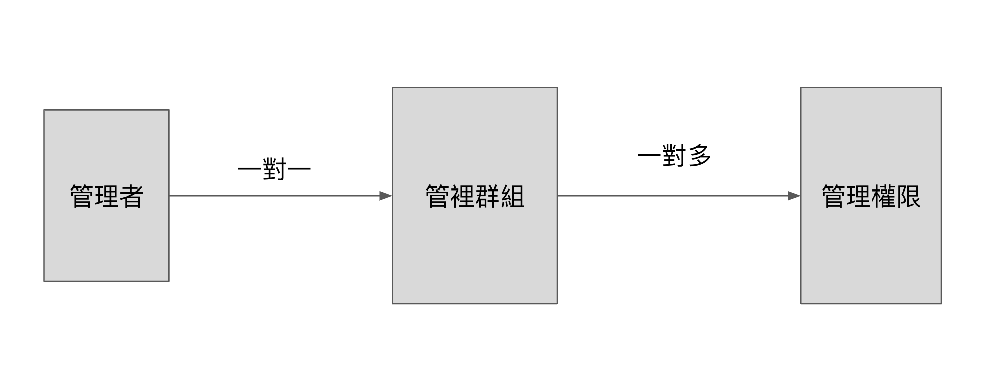

# 權限管理器

管理者 透過管理群組 group 來管理各個權限項目

關聯圖:



## 安裝
你可以使用 composer 做安裝
```bash
composer require thoth-pharaoh/permission
```

Migrate 資料表
```bash
php artisan migrate
```

匯出 Config
```bash
php artisan vendor:publish --tag=permission-config
```

匯出 Migration
```bash
php artisan vendor:publish --tag=permission-database
```

**必須先至 config/permission.php 設定權限內容**

## 使用方法

### 使用 Trait:
在欲使用權限管理的 model 引入 HasPermission Trait

```bash
use Pharaoh\Permission\Traits\HasPermission;

class User extends Authenticatable
{
    use HasPermission;
}
```

管理者加入一個管理群組
```bash
$user->addGroup($groupId);
```

| 參數 | 說明 | 類型 | 範例 |
| ------------|:----------------------- | :------| :------|
| $groupId | 管理群組ID | int | 1 |

獲取管理者所屬群組
```bash
$user->belongGroup();
```

使用 getPermissions 方法獲取該管理者所擁有的權限
```bash
$user->getPermissions();
```

使用 addPermissions 方法更新該管理群組的權限
```bash
$group->addPermissions($permissionKeys);
```

| 參數 | 說明 | 類型 | 範例 |
| ------------|:----------------------- | :------| :------|
| $permissionKeys | 權限代碼 | array | [1101, 1102, 1103] |

>  $permissionKeys 代碼以 config.permission.php 中 items 內定義為主

使用 deleteGroup 方法刪除該管理群組及對應權限
```bash
$group->deleteGroup();
```

<br/>

### 使用 Middleware:

先註冊 permission middleware

App\Http\Kernel.php
```bash
    protected $routeMiddleware = [
        ...
        'permission' => \Pharaoh\Permission\Middleware\Permission::class
    ];
```

在需要檢查權限的路由加入 permission middleware 及 權限代碼(代碼以config.permission.php為主)
```bash
Route::middleware(['auth:user', 'permission:1102'])->get('/user', 'PostController@index');
```

檢查多組權限
```bash
Route::middleware(['auth:user', 'permission:1102,1103,1104'])->get('/user', 'PostController@index');
```

>  permission middleware 需設定至 auth middleware 之後

<br/>

### 需要 group model 反查關聯的 model 資料:
動態綁定 group 多對多 多行關聯

AppServiceProvider.php
```bash
public function boot()
{
    // 動態綁定 groups <-> users 多對多 多型關聯
    Group::resolveRelationUsing('users', function ($groupModel) {
        return $groupModel->morphedByMany(User::class, 'groupable');
    });
}
```

<br/>

### 使用 Artisan Command 新增 root group 所有權限:

```bash
php artisan update:root-group-permission
```
>  root group 以 config.permission.php 中，欄位 root_group_name 名稱為主


